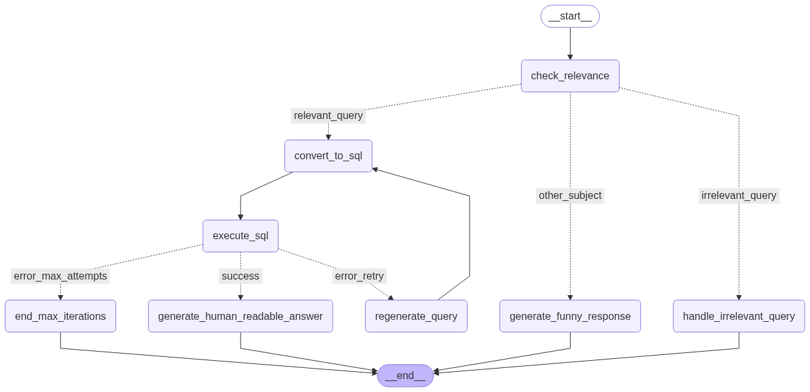

# 🏢 Real Estate Asset Management Assistant

A sophisticated LLM-powered assistant for real estate asset managers built with LangGraph, FastAPI, and Streamlit. This solution intelligently handles natural language queries about property portfolios, converts them to SQL, and provides human-readable insights.

## 🚀 Features

- **🤖 Smart Query Classification**: Distinguishes between property-related, irrelevant, and off-topic queries
- **🔍 Natural Language to SQL**: Converts user questions into valid SQL queries for property data
- **🔄 Error Handling & Retry Logic**: Automatically regenerates queries on errors (up to 3 attempts)
- **📊 Human-Readable Responses**: Transforms SQL results into clear, understandable property insights
- **💬 Conversation History**: Maintains context across multiple queries
- **🌡️ Multi-Temperature LLMs**: Different temperature settings for different tasks
- **🌐 Web Interface**: FastAPI backend with Streamlit frontend
- **🗄️ Database Integration**: Works with DuckDB and Parquet files
- **🎯 Real Estate Specialized**: Tailored prompts and responses for property management

## 🏗️ Architecture

### System Overview

The solution consists of three main components:

1. **LangGraph Agent** (`agent.py`): Core AI logic with state-based graph
2. **FastAPI Backend** (`backend/main.py`): REST API for the agent
3. **Streamlit Frontend** (`frontend/streamlit_app.py`): Web interface

### Agent Architecture

The agent implements a sophisticated state-based graph with the following nodes:




### Node Descriptions

1. **check_relevance**: Determines if the query is property-related
2. **convert_to_sql**: Converts natural language to SQL
3. **execute_sql**: Executes SQL queries on the database
4. **regenerate_query**: Refines SQL queries when errors occur
5. **generate_human_readable_answer**: Creates user-friendly property insights
6. **generate_funny_response**: Handles non-property queries with humor
7. **handle_irrelevant_query**: Explains why property queries can't be answered
8. **end_max_iterations**: Apologizes when max attempts are reached

### Multi-Temperature LLM Strategy

The agent uses different temperature settings for different tasks:

- **Classifier** (0.0): Most precise for query classification
- **SQL Generator** (0.1): Precise for SQL generation
- **Summarizer** (0.3): Balanced for human-readable summaries
- **Creative** (0.7): More creative for funny responses

## 📁 Project Structure

```
Cortex/
├── agent.py                 # Main LangGraph agent
├── backend/
│   └── main.py             # FastAPI backend server
├── frontend/
│   └── streamlit_app.py    # Streamlit web interface
├── requirements.txt         # Unified dependencies
├── cortex.parquet          # Property data
├── start_chat.py           # Direct chat interface
├── env.example           # Environment variables template
├── .gitignore             # Git ignore rules
└── README.md              # This file
```

## 🛠️ Setup Instructions

### Prerequisites

- Python 3.8 or higher
- OpenAI API key
- Git (for cloning)

### 1. Clone the Repository

```bash
git clone https://github.com/kevbenhams/cortex-assistant.git
cd cortex-assistant
```

### 2. Install Dependencies

```bash
pip install -r requirements.txt
```

### 3. Configure Environment Variables

```bash
# Copy the example environment file
cp env.example .env

# Edit the .env file with your OpenAI API key
# Replace 'your_openai_api_key_here' with your actual API key
```

Create a `.env` file with the following content:

```bash
# Required
OPENAI_API_KEY=your_openai_api_key_here

# Optional (with defaults)
LLM_MODEL=gpt-4o-mini
LLM_TEMPERATURE=0.0
LLM_TEMPERATURE_CREATIVE=0.7
LLM_TEMPERATURE_ANALYTICAL=0.1
LLM_TEMPERATURE_CLASSIFIER=0.0
LLM_TEMPERATURE_SUMMARIZER=0.3
MAX_ITERATIONS=3
PARQUET_FILE=cortex.parquet
```

### 4. Get Your OpenAI API Key

1. Visit [OpenAI Platform](https://platform.openai.com/api-keys)
2. Create a new API key
3. Add it to your `.env` file

### 5. Verify Data File

Ensure `cortex.parquet` is in the project root directory.

## 🚀 Usage

### Option 1: One-Command Start (Recommended)

```bash
python start_chat.py
```

This will automatically start both the backend and frontend, then open your browser to the chat interface.

### Option 2: Web Interface (Manual)

1. **Start the backend**:
```bash
cd backend
python main.py
```

2. **Start the frontend** (in a new terminal):
```bash
cd frontend
streamlit run streamlit_app.py
```

3. **Open your browser** to `http://localhost:8501`

### Option 3: Direct Python Interface

```python
from agent import Agent

# Initialize the agent
agent = Agent()

# Run a query
response = agent.run("What's the total profit for 2024?")
print(response)
```

## 📊 Example Queries

### Property-Related Queries
- "What's the total profit for 2024?"
- "Show me the top 5 properties by profit"
- "What's the average profit per property?"
- "Who is the most profitable Tenant ?"

### Irrelevant Property Queries
- "What's the address of each property?"
- "How many square feet is each building?"
- "What's the property valuation?"

### Off-Topic Queries
- "What's the weather like today?"
- "Tell me a joke"
- "How do I cook pasta?"

## 🔌 API Endpoints

### Backend API (FastAPI)

| Endpoint | Method | Description |
|----------|--------|-------------|
| `/` | GET | Health check |
| `/chat` | POST | Send a message |
| `/agent/info` | GET | Get agent information |
| `/agent/temperature` | GET | Get current temperatures |
| `/agent/temperature` | POST | Configure temperatures |
| `/conversation/{session_id}` | GET | Get conversation history |
| `/conversation/{session_id}` | DELETE | Clear conversation history |
| `/conversations` | GET | List all conversations |

### Example API Usage

```bash
# Send a message
curl -X POST "http://localhost:8000/chat" \
  -H "Content-Type: application/json" \
  -d '{"message": "What is the total profit for 2024?", "session_id": "user123"}'

# Get conversation history
curl "http://localhost:8000/conversation/user123"

# Configure temperatures
curl -X POST "http://localhost:8000/agent/temperature" \
  -H "Content-Type: application/json" \
  -d '{"classifier": 0.0, "creative": 0.8}'
```

## 🔧 Configuration

### Environment Variables

| Variable | Default | Description |
|----------|---------|-------------|
| `OPENAI_API_KEY` | Required | Your OpenAI API key |
| `LLM_MODEL` | gpt-4o-mini | OpenAI model to use |
| `LLM_TEMPERATURE_CREATIVE` | 0.7 | Temperature for creative responses |
| `LLM_TEMPERATURE_ANALYTICAL` | 0.1 | Temperature for SQL generation |
| `LLM_TEMPERATURE_CLASSIFIER` | 0.0 | Temperature for classification |
| `LLM_TEMPERATURE_SUMMARIZER` | 0.3 | Temperature for summaries |
| `MAX_ITERATIONS` | 3 | Maximum SQL retry attempts |
| `PARQUET_FILE` | cortex.parquet | Data file path |

### Temperature Configuration

The agent uses different temperatures for different tasks:

- **Classifier**: 0.0 (most precise for classification)
- **SQL Generator**: 0.1 (precise for SQL generation)
- **Summarizer**: 0.3 (balanced for human-readable summaries)
- **Creative**: 0.7 (more creative for funny responses)

## Development Guidelines

To extend the agent:
1. Add new nodes by creating methods following the `_node_name_node` pattern
2. Update the graph in `_build_graph` method
3. Add routing logic in conditional edge functions
4. Test with various query types

**Made with ❤️ for real estate professionals** 